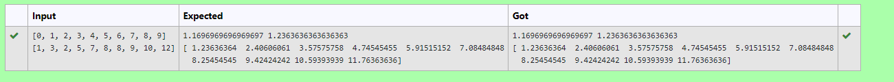

# Implementation of Univariate Linear Regression
## Aim:
To implement univariate Linear Regression to fit a straight line using least squares.
## Equipment’s required:
1.	Hardware – PCs
2.	Anaconda – Python 3.7 Installation / Moodle-Code Runner
## Algorithm:
1.	Get the independent variable X and dependent variable Y.
2.	Calculate the mean of the X -values and the mean of the Y -values.
3.	Find the slope m of the line of best fit using the formula.
 
4.	Compute the y -intercept of the line by using the formula:
  
5.	Use the slope m and the y -intercept to form the equation of the line.
6.	Obtain the straight line equation Y=mX+b and plot the scatterplot.
## Program
```
''' 
Program for Univariate linear regression using the least squares method.
Developed by: S.ABHISHEK
RegisterNumber: 21004552
'''
import numpy as np

# Preprocessing Input data
num=0
denom=0
X = np.array(eval(input()))
Y = np.array(eval(input()))

X_m=np.mean(X)
Y_m=np.mean(Y)
# Building the model
# write your code here
for i  in range(len(X)):
    num+=(X[i]-X_m)*(Y[i]-Y_m)
    denom+=(X[i]-X_m)**2
m=num/denom
b=Y_m-m*X_m

print (m, b)
Y_pred=m*X+b
#Predict the output
print (Y_pred)

```
## Sample Input and Output


## OUTPUT


## Result
Thus the univariate Linear Regression was implemented to fit a straight line using least squares.
